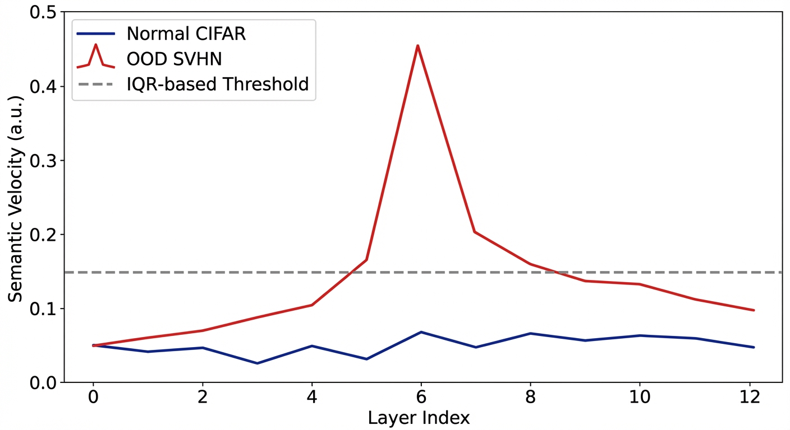

# DeepDrift

[](https://pypi.org/project/deepdrift/)
[](https://pypi.org/project/deepdrift/)
[](LICENSE)
[](https://zenodo.org/...)

**DeepDrift** — это библиотека для runtime-мониторинга нейросетей через анализ скорости изменения скрытых состояний (*Semantic Velocity*). Работает без обучения, калибруется только на нормальных данных, оверхед <1.5%.


## Установка

```bash
# Установка из исходников
git clone https://github.com/Eutonics/DeepDrift.git
cd DeepDrift
pip install .

# Или через pip (после публикации)
# pip install deepdrift
```

## Быстрый старт (ViT OOD)

```python
from deepdrift import DeepDriftMonitor
from torchvision.models import vit_b_16
import torch

# 1. Инициализация монитора
model = vit_b_16(pretrained=True)
monitor = DeepDriftMonitor(
    model,
    layer_names=['encoder.layers.5', 'encoder.layers.11'], # наблюдаем за слоями 5 и 11
    pooling='cls'
)

# 2. Прогон данных
x = torch.randn(1, 3, 224, 224) # батч изображений
_ = model(x)

# 3. Расчет Semantic Velocity
velocities = monitor.get_spatial_velocity()
print(f"Peak velocity: {max(velocities):.4f}")
```

## Примеры использования

### 1. Обнаружение OOD в Vision Transformers
Используйте `DeepDriftVision` для автоматической калибровки и обнаружения Out-of-Distribution данных.



| Dataset | Metric | AUC (DeepDrift) |
|---------|--------|-----------------|
| CIFAR-100 (In) | - | - |
| SVHN (OOD) | Peak Velocity | **0.982** |
| LSUN (OOD) | Peak Velocity | **0.975** |

```python
from deepdrift import DeepDriftVision
monitor = DeepDriftVision(model)
monitor.fit(train_dataloader) # Калибровка на нормальных данных
diagnosis = monitor.predict(test_batch)
if diagnosis.is_anomaly:
    print("OOD Detected!")
```

### 2. Предсказание краха RL-агентов (LunarLander, CartPole)
Мониторинг временной скорости (`temporal velocity`) позволяет предсказать потерю управления за 5-10 шагов до катастрофы.

```python
from deepdrift.rl import DeepDriftRL
monitor = DeepDriftRL(agent.policy, threshold=0.15)

for obs in episode:
    diag = monitor.step(obs)
    if diag.is_anomaly:
        print(f"⚠️ Warning: High instability detected! Velocity: {diag.peak_velocity}")
```

### 3. Детекция галлюцинаций в LLM
Интеграция с генеративным циклом Hugging Face для отслеживания семантических скачков при генерации токенов.

```python
from deepdrift import DeepDriftGuard
guard = DeepDriftGuard(llm_model)

for token in generation_loop:
    diag = guard(token)
    if diag.is_anomaly:
        print("Possible hallucination detected.")
```

### 4. Раннее обнаружение меморизации в диффузионных моделях
Анализ «Burning Bottleneck» в U-Net структурах позволяет выявить переобучение на ранних стадиях без использования валидационного сета.

```python
# Смотри experiments/diffusion_memorization.py
```

## API Reference

### `DeepDriftMonitor`
Главный класс для низкоуровневого мониторинга.
- `__init__(model, layer_names, pooling, n_channels, ...)`
- `get_spatial_velocity()`: L2-нормы между последовательными слоями.
- `get_temporal_velocity()`: Изменение состояния во времени.
- `calibrate(dataloader)`: Авто-расчет порога через IQR.

### `DeepDriftVision` / `DeepDriftGuard`
Специализированные обертки с обратной совместимостью и упрощенным API.

## Воспроизведение экспериментов

```bash
git clone https://github.com/Eutonics/DeepDrift
cd DeepDrift
bash scripts/reproduce_all.sh
```

## Цитирование

```bibtex
@article{evtushenko2026deepdrift,
  title={DeepDrift: Zero-Training Hidden-State Monitoring for Robustness in Vision, Language, and Generative Models},
  author={Alexey Evtushenko},
  year={2026},
  journal={arXiv preprint},
  url={https://github.com/Eutonics/DeepDrift}
}
```

## Лицензия
MIT

---
Generated using K-Dense Web ([k-dense.ai](https://k-dense.ai))
