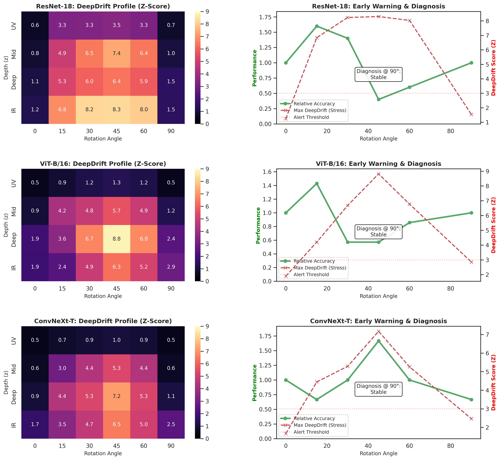
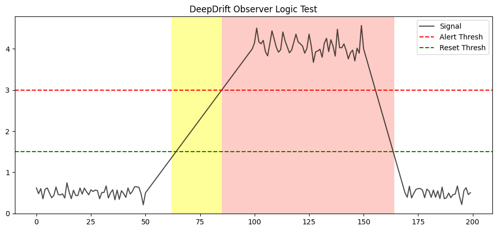

# DeepDrift

[](https://doi.org/10.5281/zenodo.18086612)
[](https://opensource.org/licenses/MIT)
[](https://pytorch.org/)

**A Layer-Wise Diagnostic Framework for Neural Network Robustness.**

> "Stop guessing *why* your model failed. See exactly *where* it broke."

DeepDrift is an unsupervised diagnostic tool that acts like an **MRI scan for your neural network**. Instead of just monitoring output accuracy (which is a lagging indicator), DeepDrift analyzes how data representations evolve layer-by-layer in real-time.

It allows you to distinguish between:
*   **Sensor Failure** (High drift at input layers)
*   **Geometric Collapse** (Drift accumulation in deep layers)
*   **Spurious Correlations** (Anomalies in mid-level features)



## 🚀 Key Features

*   **Unsupervised:** No labeled OOD data required. Works in production.
*   **Lightweight:** < 1% inference overhead.
*   **Interpretability:** Maps drift to network depth ($z$-axis).
*   **AI Doctor:** Built-in heuristics to classify failure modes.

## 🧠 Under the Hood: Predictive Monitoring

DeepDrift isn't just a threshold check. It implements a stateful **Finite State Machine (FSM)** with hysteresis and trend analysis to prevent alert fatigue.



*   **⚠️ Early Warning (Yellow):** Detects rapid drift acceleration ($\beta$-slope) *before* the critical threshold is breached.
*   **🔴 Critical Alert (Red):** Triggers when structural integrity is compromised.
*   **🟢 Hysteresis Recovery:** The alert stays active until the system stabilizes significantly below the threshold, preventing flickering alarms.

## 📦 Installation

```bash
git clone https://github.com/Eutonics/DeepDrift.git
cd DeepDrift
pip install .
```

⚡ Quick Start
1. Real-time Monitoring (Production Mode)
Use the stateful monitor to track model health with hysteresis and trend detection.
codePython

```
import torch
import torchvision.models as models
from deepdrift import DeepDriftMonitor, ObserverConfig

# 1. Load your model
model = models.resnet18(pretrained=True)
model.eval()

# 2. Configure Sensitivity
# theta_slope: Detects rapid drift acceleration
# theta_high: Critical alert threshold (Sigma)
config = ObserverConfig(theta_high=3.0, theta_slope=0.05, window_size=20)
monitor = DeepDriftMonitor(model, arch_name='ResNet-18', drift_config=config)

# 3. Calibrate on clean data (establish baseline)
# monitor.calibrate(train_loader, max_batches=50)

# 4. Monitoring Loop
# status, alerts = monitor.step(incoming_batch)

# if alerts:
#     for alert in alerts:
#         print(alert)
#         # Output: "⚠️ WARNING [Mid]: Rapid Drift Detected (Slope 0.045)"
#         # Output: "🔴 ALERT [IR]: Threshold Breach (3.2 >= 3.0)"
```

2. Static Diagnosis (Research Mode)
Analyze a single batch to get a spectral signature and diagnosis.
codePython

```
from deepdrift import diagnose_drift, plot_drift_profile

# ... (after calibration) ...

# Get raw profile
drift_profile = monitor.step(ood_batch)[0] # Extract drift values

# Get Diagnosis
diagnosis = diagnose_drift([d['drift'] for d in drift_profile.values()])
print(f"Diagnosis: {diagnosis}")
# Output: "WARNING: Avalanche Effect (Geometric Failure)"
```

📚 Research & Publications
DeepDrift is backed by research on Renormalization Group theory in Deep Learning.

1. DeepDrift: A Layer-Wise Diagnostic Framework for Neural Network Robustness (2025)

   * The foundational paper describing the framework and metrics.

2. Spatial Dynamics of Memorization in Diffusion Models (2025)

   * Application of DeepDrift to discover the "Burning Bottleneck" phenomenon in U-Nets.

📄 Citation
If you use DeepDrift in your research, please cite:
codeBibtex

```
@article{evtushenko2025deepdrift,
  title={DeepDrift: A Layer-Wise Diagnostic Framework for Neural Network Robustness},
  author={Evtushenko, Alexey},
  journal={arXiv preprint},
  doi={10.5281/zenodo.18086612},
  year={2025}
}
```

License
This project is licensed under the MIT License.
codeCode

```
```
